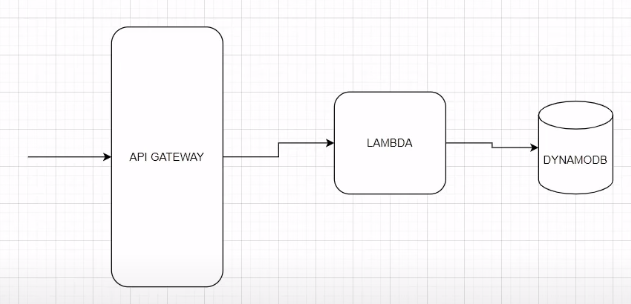

# Go and AWS - Code and Deploy a Serverless API

This repository contains the code for a serverless API built with Go and deployed on AWS using services like Lambda, API Gateway, and DynamoDB.

## Table of Contents

- [Introduction](#introduction)
- [Prerequisites](#prerequisites)
- [Installation](#installation)
- [Usage](#usage)
- [Architecture](#architecture)
- [Deployment](#deployment)
- [Documentation](#documentation)

## Introduction

This project demonstrates how to create and deploy a serverless API using Go and AWS. The API leverages AWS Lambda for serverless computing, API Gateway for request routing, and DynamoDB for data storage.

## Prerequisites

Before you begin, ensure you have met the following requirements:
- Go installed on your local machine.
- An AWS account.
- AWS CLI configured on your local machine.
- Basic knowledge of Go and AWS services.

## Installation

Clone the repository:

```bash
git clone https://github.com/your-username/your-repo-name.git
cd your-repo-name
```

Install the required Go packages:

```bash
go get github.com/aws/aws-sdk-go/aws
go get github.com/aws/aws-sdk-go/service/lambda
go get github.com/aws/aws-lambda-go/lambda
```

## Usage

### Running Locally

To run the application locally, use the following command:

```bash
GOOS=linux GOARCH=amd64 CGO_ENABLED=0 go build -o main main.go
./main
```

### Testing the API

You can test the API endpoints using `curl` or any API testing tool like Postman. Here are some example `curl` commands:

```bash
curl --header "Content-Type: application/json" --request POST --data '{"email": "jose@gmail.com", "firstName": "Jose", "lastName": "Hurtado"}' https://your-api-endpoint
curl --header "Content-Type: application/json" --request GET https://your-api-endpoint?email=jose@gmail.com
```

## Architecture

The architecture of this serverless API involves several AWS services and follows a modular design. Below is a diagram illustrating the high-level architecture of the system:



### Components

- **API Gateway**: Acts as the entry point for API requests and routes them to the appropriate Lambda function.
- **AWS Lambda**: Executes the application logic without provisioning or managing servers.
- **DynamoDB**: Provides a NoSQL database for storing user data.

## Deployment

To deploy the application to AWS:

1. **Build the Go executable**:

   ```bash
   GOOS=linux GOARCH=amd64 CGO_ENABLED=0 go build -o main main.go
   ```

2. **Package the code**:

   ```bash
   zip main.zip main
   ```

3. **Upload to AWS Lambda**:
   - Go to the AWS Lambda console.
   - Create a new function or update an existing one.
   - Upload the `main.zip` file.
   - Set the handler to `main`.

4. **Configure API Gateway**:
   - Go to the API Gateway console.
   - Create a new API or update an existing one.
   - Configure the methods and integrate with the Lambda function.

5. **Create DynamoDB Table**:
   - Go to the DynamoDB console.
   - Create a table with the required schema (e.g., a table named `users` with `email` as the primary key).
  
## Documentation

If you want to check the complete documentation: https://josehurtadobaeza.super.site/databases/blog-posts-database/doing-go-and-aws-code-and-deploy-a-serverless-api-freecodecamp
